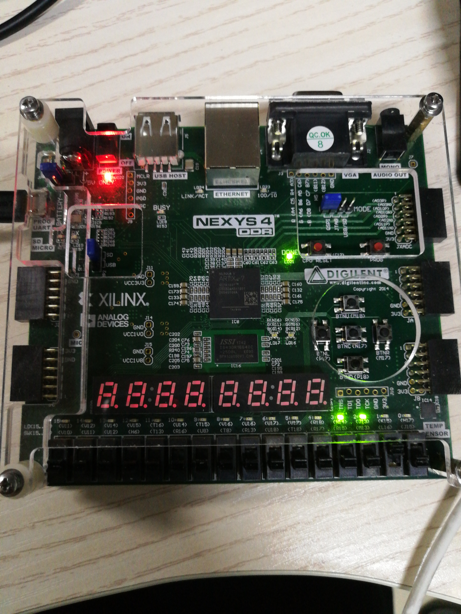
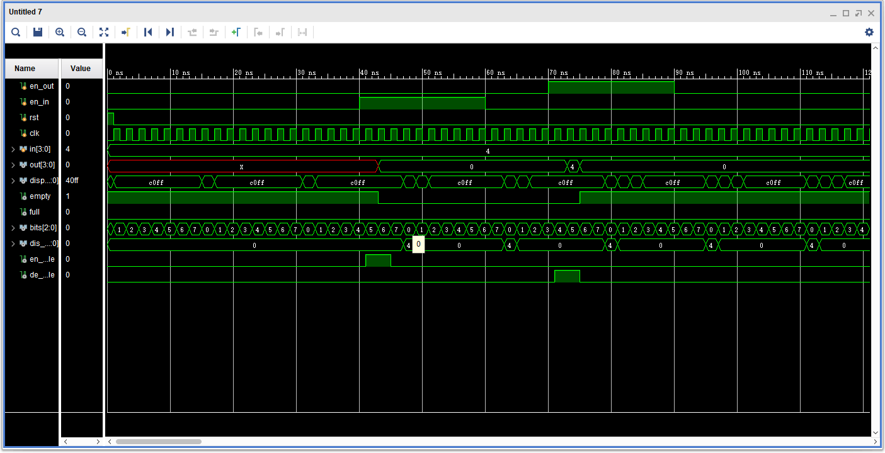

# Lab3_PB17111568_郭雨轩
## Lab3_1 寄存器堆
### 设计思路
- 寄存器堆的设计比较简单，首先对应端口及其含义已经给出，写入数据是同步的，所以要在每个时钟上升沿判断写使能信号是否为enable，若是则写入。读数据因为是异步信号，所以这部分用组合逻辑描述即可。

### 实验代码

源代码：

``` verilog
module Reg_File(
    input [2:0]ra0,ra1,wa,
    input [3:0]wd,
    input we,rst,clk,
    output reg [3:0]rd0,rd1
    );
    reg [3:0]reg_file[7:0];
    always @ (posedge clk or posedge rst)
    begin
        if (rst)
        begin
            reg_file[0]=0;
            reg_file[1]=0;
            reg_file[2]=0;
            reg_file[3]=0;
            reg_file[4]=0;
            reg_file[5]=0;
            reg_file[6]=0;
            reg_file[7]=0;
        end
        else
        begin
            if (we)
            begin
                reg_file[wa]=wd;
            end
        end
    end
    always @ (*)
    begin
        rd0=reg_file[ra0];
        rd1=reg_file[ra1];
    end
endmodule
```

仿真代码：

``` verilog
module Reg_File_tb(

    );
    wire [3:0]rd0,rd1;
    reg rst,clk,we;
    reg [2:0]ra0,ra1,wa;
    reg [3:0]wd;
    Reg_File U (ra0,ra1,wa,wd,we,rst,clk,rd0,rd1);
    
    initial clk=0;
    always #2 clk=~clk;
    
    initial
    begin
        rst=0;#1;
        rst=1;#1;
        rst=0;
    end
    
    initial 
    begin
        ra0=0;
        ra1=0;
        #11;
        ra0=3;
        ra1=5;
    end
    
    initial 
    begin
        we=0;#10;
        we=1;#2;
        we=0;
    end
    
    initial 
    begin
        wa=0;wd=1;#10;
        wa=3;wd=4;#3;
        wa=0;#2;
    end
    
endmodule
```

### 仿真和下载截图

仿真截图：


下载截图：



### 结果分析

出现这个运行结果，首先将wa置为2，wd置为4‘b1100，再将we置为1，然后按一下时钟触发上升沿，最后将异步读取端口的地址置为2，即可读出数据

## Lab3_2

### 设计思路

计数器的设计思路同样十分简单，计科基本的功能实现如下：

- 同步置数只需要在上升沿的时候判断同步置数使能是否为1，若为1则直接将数字更新到cnt中
- 异步清零通过检测rst的上升沿实现
- 计数使能则是当进入上升沿时，当计数使能为1的时候将count+1，否则保持不变即可

### 实验代码

源代码：

``` verilog
module CNT(
    input ce,pe,rst,clk,
    input [3:0]d,
    output reg [3:0]q
    );
    
    always @ (posedge clk or posedge rst)
    begin
        if (rst)
        begin
            q=0;
        end
        else
        begin
            if (pe)
                q=d;
            else if (ce)
                q=q+1;
            else 
                q=q;
        end
    end
endmodule
```

### 实验截图

下载图：


### 结果分析

当将计数使能打开时，每次上升沿就会更新数字。当同步置数打开时，经历过一次上升沿就可以将设定的数字放到计数器中。

## Lab3_3

### 设计思路

本实验是这次实验中最难的一个，也是我花费时间最多的一个实验，本实验报告着重讲解这部分内容：

- 首先将功能划分为几个模块，REGfiles，数码管显示部分和外层状态机。其中REGfiles只负责读取和写入数据，外层状态机负责在不同时间段向REGfiles送入指定的数据，数码管显示部分是纯组合逻辑，用来将读取到的信息转换成[15:0]display。
- 再根据REGfiles的端口设计如何使用，其中REGfiles有两个异步读取的端口，ra0被我用来读取显示到数码管的信息，ra1用来显示出队列元素的信息。
- 这其中最难设计的部分当属主状态机部分，这部分代码分为以下几个部分：
  - 首先是两个一段式状态机，这两个状态机的作用是将异步输入的进队列使能和出队列使能转换为一个时钟周期宽的高电平信号，也就是说，无论输入的进队列使能和出队列使能持续时间多长，都只会使得一个元素进队列或者出队列。
  - 其次是数码管显示的状态机，这个部分比较简单，只需要按照地址0~7不断刷新显示数码管中的内容即可。
  - 在实现控制进出队列的状态机之前，首先需要使用数据流建模的方式将一些信号提前描述，主要是是否允许进入队列，我的判定方法是：当且仅当进队列使能且队列非满的时候才可以进队，只有出队列使能时且队列非空的时候才可以出队列。
  - 此外还需要一些寄存器变量来储存队列的信息，其中，count表示队列中元素的个数，head表示头元素所在的位置，addr_in表示下一个要进入队列的元素将要写入的地址（由于写入元素实在REGfiles模块中进行，所以在时钟沿到来的时候需要先将所用到的数据都准备好，故addr中存放的是下一个要进队的地址），addr_out表示最近一个出队列的元素的地址，used表示8个位置是否有元素。
  - 那么，主状态机就非常好描述了，抛开初始化的部分不谈。当可以进队的时候，先将下一个要进队的地址递增，然后把当前的used位置为1，count+1。当可以出队的时候，只需要将used置为0，并将count-1，head+1即可。
- REGfiles接入的信号如下：其中we接入允许进队的信号，wa接入addr_in，wd直接与输入的in相连，ra0接到显示部分的地址，ra1接到addr_out就可以了。

### 实验代码

源代码：

``` verilog
module FIFO(
    input en_out,en_in,rst,clk_in,
    input [3:0]in,
    output [3:0]out,
    output [15:0]display,
    output empty,full,
    output reg [2:0]addr_in
    );
    wire clk_5mhz,clk_500hz,lock;
    clk_wiz_0 U1 (clk_5mhz,0,lock,clk_in);
    clock_500hz U2 (clk_5mhz,0,0,clk_500hz);
    reg [3:0]addr_dis,addr_out;
    wire en_queue,de_queue,en_queue_able,de_queue_able;
    wire [3:0]dis_data;
    reg [7:0]used;
    reg [3:0]count;
    reg [2:0]head;
    reg [1:0]flag_in,flag_out;
    always @ (posedge rst or posedge clk_500hz)
    begin
        if (rst)
            flag_in=2'b00;
        else
        begin
            if (en_in && flag_in==2'b00)
                flag_in=2'b01;
            else if (en_in && flag_in==2'b01)
                flag_in=2'b10;
            else if (en_in && flag_in==2'b11)
                flag_in=2'b10;
            else if (en_in && flag_in==2'b10)
                flag_in=2'b10;
            else 
                flag_in=2'b00;
        end
    end
        
    always @ (posedge rst or posedge clk_500hz)
    begin
        if (rst)
            flag_out=2'b00;
        else
        begin
            if (en_out && flag_out==2'b00)
                flag_out=2'b01;
            else if (en_out && flag_out==2'b01)
                flag_out=2'b10;
            else if (en_out && flag_out==2'b11)
                flag_out=2'b10;
            else if (en_out && flag_out==2'b10)
                flag_out=2'b10;
            else
                flag_out=2'b00;
        end
    end
    assign en_queue=flag_in[0];
    assign de_queue=flag_out[0];
    assign en_queue_able=en_queue & ~full;
    assign de_queue_able=de_queue & ~empty;
    assign full=(count==4'd8);
    assign empty=(count==4'd0);
    
    
    /*主状态机*/
        always @ (posedge clk_500hz or posedge rst)
        begin
            if (rst)
            begin
                count=4'b000;
                head=4'b0000;
                used=8'b00000000;
                addr_in=4'b0000;
                addr_out=4'b0000;
            end
            else
            begin
                if (en_queue_able)//EnQueue
                begin
                    count=count+1;
                    used[addr_in]=1'b1;
                    addr_in = addr_in+1;//传出addr到reg_file,写入新元素
                end
                else if (de_queue_able)
                begin
                    count=count-1;
                    addr_out = head;//传出addr到reg_file的ra1,读出出队元素
                    head=head+1;
                    used[addr_out]=1'b0;
                end
            end
        end
    
    
    Reg_File U4 (addr_dis,addr_out,addr_in[2:0],in,en_queue_able,rst,clk_500hz,dis_data,out);//rd0用于读取数码管信息，rd1读取出队列信息
    
    wire is_head,is_dis;
    assign is_head = (addr_dis==head);
    assign is_dis = (used[addr_dis]==1);
    bcd_decoder U5 (is_dis,is_head,addr_dis,dis_data,display);
    
    
    always @ (posedge clk_500hz or posedge rst)
    begin
        if (rst)
            addr_dis=0;
        else
            addr_dis=addr_dis+1;
    end
    
endmodule
```

仿真代码：

``` verilog
module FIFO_tb(

    );
    reg en_out,en_in,rst,clk;
    reg [3:0]in;
    wire [3:0]out;
    wire [15:0]display;
    wire empty,full;
    wire [2:0]bits;
    wire [3:0]dis_data;
    wire en_queue_able,de_queue_able;
    wire [2:0]dis_addr;
    FIFO U (en_out,en_in,rst,clk,in,out,display,empty,full,dis_data,dis_addr);
    initial clk=0;
    always #1 clk=~clk;
    initial 
    begin
        rst=1;#10;
        rst=0;#1990;
        rst=0;
    end
    initial 
    begin
        en_out=0;
        
    end
    initial en_in=0;
    always #200000en_in=~en_in;
    initial in=4;
    
endmodule

```

### 实验截图

仿真截图：



下载截图：


### 结果分析

当进队列使能3次，1进队，2进队，3进队，出队列1次，1出队，此时队列头是2，出队列元素的信息是1。

## 实验总结

本次实验帮我回忆了数码管的使用，同时还在无意中避开了一个大坑：当两个模块在同一个时钟控制的时候，若后一个模块要用到前一个模块给出的信息，则需要在上升沿之前将对应的数据给好才不会出错